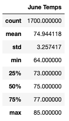

# surfs_up
## Background
A data analyst pitches a business idea to an investor, W. Avy, who shares his same passion for surfing. The idea is to open "Surf and Shake," a shop serving surfboards and ice cream to locals and tourist on the island of O'ahu, Hawaii. W. Avy emabarked on similar venture in the past, but the made the mistake of not evaluating weather data, and the shop was rained out of existance. He's adamant about making sure this island is the right location before moving forward, and asks the data analyst for a deep dive into the weather conditions on the island. 

An initial analysis has been performed to determine the average temperature and precipitation for the previous year month by month, also analyzing the data by the station with the most data. The analysis shows the conditions are favorable, but the investor, W. Avy, now wants to take a closer look at the months of June and December to ensure the idea for the shop is sustainable year round. 

## Results
Pulling from the hawaii.sqlite data file, we've extracted and filtered the data to retreive a list of temperatures for the months of June and December. After saving the information to data frames, the summary statistics have been pulled for both:

**Temperature Summary Statistics for June**

**Temperature Summary Statistics for December**

**Key Findings:**
* The average temperature for June is 75 degrees farenheight and 71 for December.
* The minimum temeratures are 64 for June and 56 for December, while the max temperatures are above 80 for each.
* There is a substantial count for for temperature recordings for both months (1500+), and the splits by quartile, fall well above the minimum temps recorded indicating, warmer temperatures overall throughout the month, per the average.

Additionally, following the same process and data source, summary statistics for precipitation was pulled for both months.

**Precipitation Summary Statistics for June**

**Precipitation Summary Statistics for December**

## Summary
Overall the temperature data is favorable for these 2 months, but it may worth diving deeper into the percipitation data, as the averages and even quartiles are under 1, indicating light rain, but the maximums are well above 1. Additional analysis can be conducted to see:
* How many days out of each month rained.
* How temperatures correlate to rain.
* How the results for both the previous points compare to the other months of the year.
* Looking at the same data for the most active stations.

## Sources
* Database: hawaii.sqlite
* Software: Python 3.7.13, SQLite, SQLAlchemy
